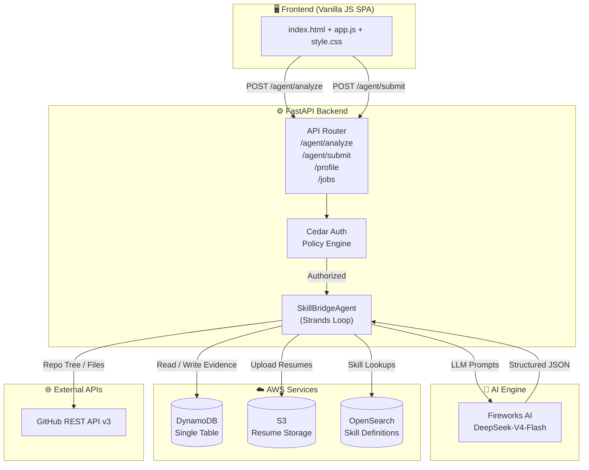
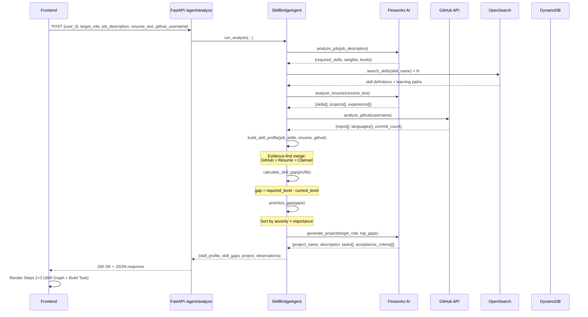
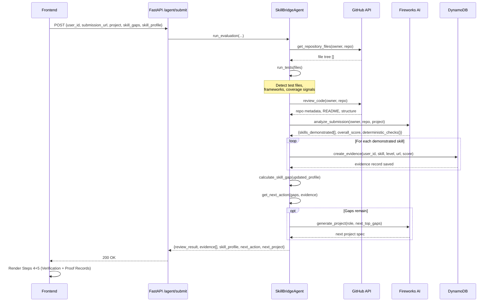
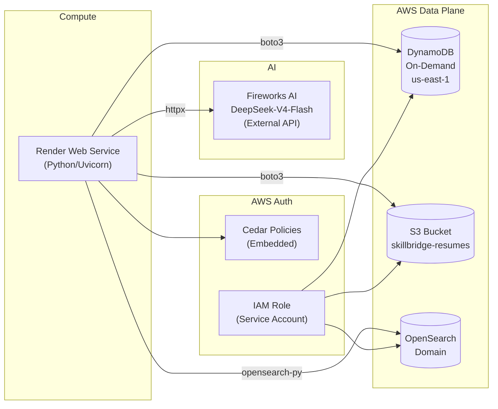
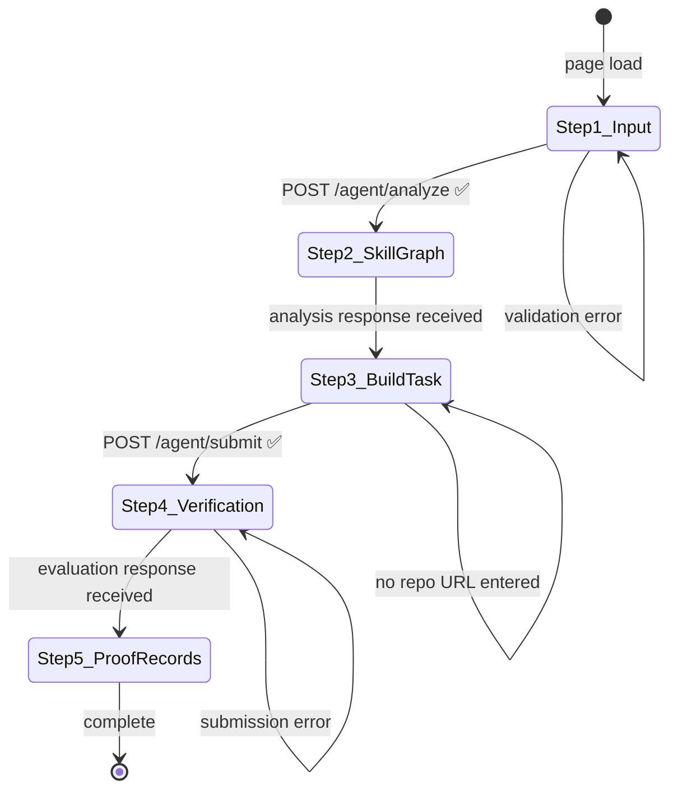
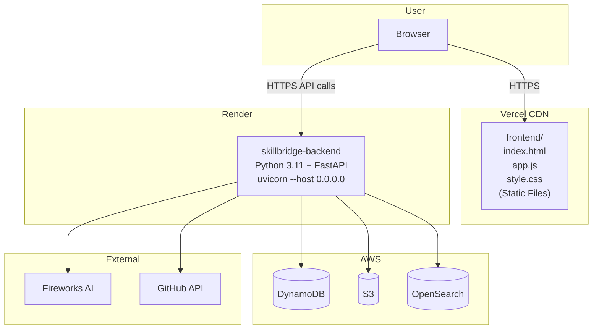

# SkillBridge AI — System Architecture

> Detailed technical architecture for the SkillBridge AI Career Readiness Engine.

---

## Table of Contents

1. [High-Level Overview](#1-high-level-overview)
2. [Component Breakdown](#2-component-breakdown)
3. [Data Flow — Analysis Pipeline](#3-data-flow--analysis-pipeline)
4. [Data Flow — Evaluation Pipeline](#4-data-flow--evaluation-pipeline)
5. [Agentic Loop Design](#5-agentic-loop-design)
6. [AWS Services Architecture](#6-aws-services-architecture)
7. [DynamoDB Single-Table Design](#7-dynamodb-single-table-design)
8. [Authorization — Cedar Policies](#8-authorization--cedar-policies)
9. [Frontend State Machine](#9-frontend-state-machine)
10. [Deployment Architecture](#10-deployment-architecture)
11. [Local Development Mode](#11-local-development-mode)

---

## 1. High-Level Overview



---

## 2. Component Breakdown

### 2.1 Frontend (SPA)

| File | Responsibility |
|------|----------------|
| `frontend/index.html` | Single HTML entry point — defines the 5-step UI scaffold |
| `frontend/app.js` | All state management, fetch calls, DOM rendering, 5-step flow controller |
| `frontend/style.css` | Dark-mode design system with CSS variables, glassmorphism cards, animations |

**UI Flow (5 Steps):**
```
Step 1: Input Form  →  Step 2: Skill Graph  →  Step 3: Build Task
Step 4: Verification  →  Step 5: Proof Records
```

### 2.2 FastAPI Backend

| Module | Path | Responsibility |
|--------|------|----------------|
| `main.py` | `app/main.py` | Application factory — mounts routers, CORS, startup events |
| `agent.py` | `app/api/agent.py` | `/agent/analyze` and `/agent/submit` route handlers |
| `profile.py` | `app/api/profile.py` | `/profile/{user_id}` — reads evidence from DynamoDB |
| `jobs.py` | `app/api/jobs.py` | `/jobs` — returns available job role templates |

### 2.3 Strands Agent

| Module | Path | Responsibility |
|--------|------|----------------|
| `strands_agent.py` | `app/agent/strands_agent.py` | `SkillBridgeAgent` class with `run_analysis()` and `run_evaluation()` pipelines |
| `tools.py` | `app/agent/tools.py` | Tool registry — imports and re-exports all tool functions for the agent |

### 2.4 Core Tools

| Tool | Implementation | Description |
|------|---------------|-------------|
| `analyze_job` | `app/tools/__init__.py` | LLM: parses job description into structured requirements + skill weights |
| `extract_job_skills` | `app/tools/__init__.py` | Extracts flat skill list from structured job requirements |
| `analyze_resume` | `app/tools/__init__.py` | LLM: extracts skills, experience, education from resume text |
| `analyze_github` | `app/tools/__init__.py` | GitHub API: fetches repos, languages, commits, READMEs |
| `build_skill_profile` | `app/tools/__init__.py` | Merges resume + GitHub data into unified evidence-first skill profile |
| `calculate_skill_gap` | `app/tools/__init__.py` | Deterministic gap calculation: required_level − current_level per skill |
| `prioritize_gap` | `app/tools/__init__.py` | Ranks gaps by severity × importance weight |
| `generate_project` | `app/tools/__init__.py` | LLM: generates tailored engineering project for top gaps |
| `analyze_submission` | `app/tools/__init__.py` | LLM + AST: evaluates submitted repo against project criteria |
| `run_tests` | `app/tools/__init__.py` | Detects test files/frameworks in repository file tree |
| `review_code` | `app/tools/__init__.py` | GitHub API + LLM: code style, structure, CI/CD signal review |
| `create_evidence` | `app/tools/__init__.py` | Writes verified skill evidence record to DynamoDB |
| `get_next_action` | `app/tools/__init__.py` | Decides next agent step: generate_project or complete |
| `search_skills` | `app/tools/__init__.py` | Queries OpenSearch for skill definitions and learning paths |
| `get_repository_files` | `app/tools/__init__.py` | GitHub API: fetches flat file tree for a given owner/repo |
| `verify_skill` | `app/tools/__init__.py` | Cross-validates skill evidence against DynamoDB records |

### 2.5 Service Layer

| Service | File | Description |
|---------|------|-------------|
| LLM | `app/services/llm.py` | Fireworks AI client — wraps API calls, handles retries, structured JSON output |
| DynamoDB | `app/services/dynamodb.py` | Single-table CRUD: `save_skill`, `get_skills`, `save_evidence`, `get_evidence` |
| GitHub | `app/services/github.py` | REST API wrapper: repo listing, tree fetching, language stats |
| Cedar | `app/services/cedar.py` | Cedar policy evaluation — ABAC for evidence read/write access |
| OpenSearch | `app/services/opensearch.py` | Skill definition lookups, semantic search, learning path recommendations |
| S3 | `app/services/s3.py` | Resume PDF upload/download with presigned URLs |
| Bedrock | `app/services/bedrock.py` | AWS Bedrock fallback LLM client |

---

## 3. Data Flow — Analysis Pipeline

When the user submits the form and clicks **"Run Evidence Analysis"**, this pipeline executes:



---

## 4. Data Flow — Evaluation Pipeline

When the user submits a GitHub repository URL for automated review:



---

## 5. Agentic Loop Design

SkillBridge implements the **Strands Agents SDK** pattern:

```
GOAL → AGENT → TOOL SELECTION → TOOL EXECUTION → OBSERVATION → STATE UPDATE → AGENT
```

```python
class SkillBridgeAgent:
    observations: List[AgentObservation]   # Full audit trail
    state: Dict[str, Any]                  # Shared agent memory

    def run_analysis(...) -> Dict:
        # 8-step sequential tool pipeline
        # Each step: decide tool → execute → _observe() → update state

    def run_evaluation(...) -> Dict:
        # 8-step evaluation pipeline
        # Loops back to generate_project if gaps remain
```

**Key design decisions:**
- **Sequential, not parallel** — each tool's output informs the next tool's input
- **Observation logging** — every tool call is recorded with success/failure + truncated result
- **State accumulation** — `self.state` grows through the pipeline (job_req → profile → gaps → project)
- **Graceful degradation** — each step has try/except; partial failures don't abort the pipeline
- **Loop condition** — agent loops (generates next project) only when `get_next_action` returns `"generate_project"`

---

## 6. AWS Services Architecture



---

## 7. DynamoDB Single-Table Design

All data lives in a single DynamoDB table (`skillbridge-evidence`) using a composite key design:

| PK | SK | Attributes | Description |
|----|-----|------------|-------------|
| `USER#ankush` | `SKILL#python` | `current_level`, `required_level`, `evidence_status`, `evidence_repos[]` | Skill record |
| `USER#ankush` | `EVIDENCE#<timestamp>` | `skill`, `level`, `submission_url`, `project_name`, `review_score`, `checks{}` | Evidence record |
| `USER#ankush` | `PROFILE` | `target_role`, `github_username`, `created_at` | User profile |

**Access patterns:**
- Get all skills for user → `PK = USER#<id>` + `SK begins_with SKILL#`
- Get all evidence → `PK = USER#<id>` + `SK begins_with EVIDENCE#`
- Get specific skill → `PK = USER#<id>` + `SK = SKILL#<skill_name>`

---

## 8. Authorization — Cedar Policies

Cedar policies govern evidence record access:

```cedar
// A candidate can only read their own evidence
permit (
    principal == User::"ankush",
    action == Action::"ReadEvidence",
    resource == EvidenceRecord::"ankush"
);

// Only the agent service can write evidence
permit (
    principal == Service::"skillbridge-agent",
    action == Action::"WriteEvidence",
    resource is EvidenceRecord
);
```

Cedar evaluation happens in `app/services/cedar.py` before any DynamoDB write operation.

---

## 9. Frontend State Machine

The frontend (`app.js`) maintains a 5-step state machine:



**State variables:**
```javascript
let currentFlowStep = 1;        // 1-5 step tracker
let analysisResults = null;     // /agent/analyze response cache
let evaluationResults = null;   // /agent/submit response cache
let threadId = null;            // Session ID for stateful requests
```

---

## 10. Deployment Architecture



**Environment variables for production (set in Render dashboard):**

```env
MODE=build
STRANDS_PROVIDER=fireworks
FIREWORKS_API_KEY=<secret>
FIREWORKS_MODEL=accounts/fireworks/models/deepseek-v4-flash-0731
AWS_ACCESS_KEY_ID=<secret>
AWS_SECRET_ACCESS_KEY=<secret>
AWS_DEFAULT_REGION=us-east-1
DYNAMODB_TABLE=skillbridge-evidence
```

---

## 11. Local Development Mode

`local_runner.py` bootstraps the full stack locally with AWS mocks:

```
                  ┌─────────────────────────────────┐
                  │         local_runner.py          │
                  │                                  │
                  │  1. Load .env                    │
                  │  2. Start moto DynamoDB mock     │
                  │  3. Create table + seed data     │
                  │  4. Serve FastAPI (port 8000)    │
                  │  5. Serve frontend (port 3000)   │
                  └─────────────────────────────────┘
                           │           │
              ┌────────────┘           └────────────┐
              ▼                                     ▼
    http://localhost:8000              http://localhost:3000
    (FastAPI + Swagger UI)             (Frontend SPA)
```

**Mock behavior by environment:**

| Service | `MODE=mock` (default local) | `MODE=build` (real AWS) |
|---------|---------------------------|------------------------|
| DynamoDB | moto in-memory mock | Real AWS DynamoDB |
| S3 | moto in-memory mock | Real AWS S3 |
| OpenSearch | Static JSON fallback | Real OpenSearch domain |
| LLM (Fireworks) | Real API calls | Real API calls |
| GitHub API | Real API calls | Real API calls |

> **Note:** Fireworks AI and GitHub API always use real calls — only AWS services are mocked locally.

---

*Architecture document for SkillBridge AI — First Commit Bharat Hackathon, AWS BUILD IT Track.*
