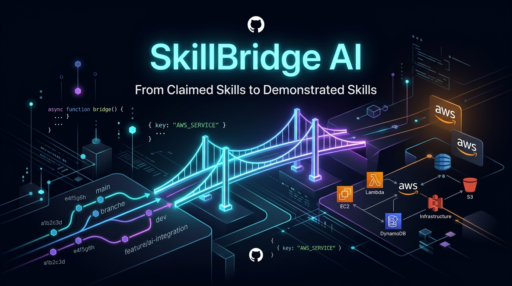
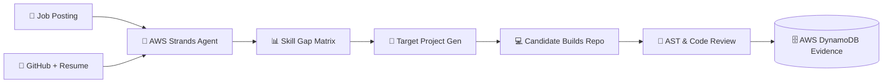
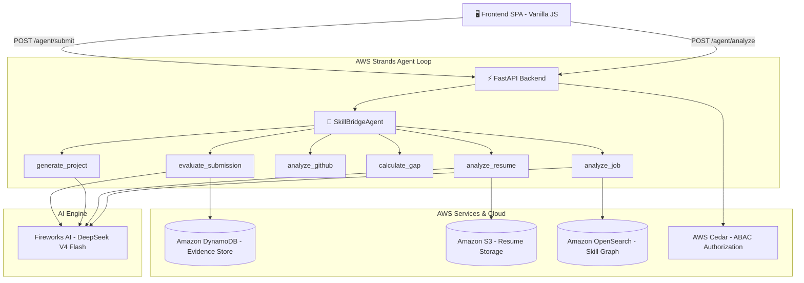

<div align="center">



# SkillBridge AI 🚀

### *From Claimed Skills → Demonstrated Skills*

**Autonomous Career Readiness Engine powered by AWS Strands SDK + Fireworks AI**

[](https://aws.amazon.com)
[](https://python.org)
[](https://fastapi.tiangolo.com)
[](https://aws.amazon.com/dynamodb/)
[](https://fireworks.ai)
[](https://skillbridge-aws.vercel.app)
[](https://skillbridge-aws.onrender.com)
[](LICENSE)

### 🌐 Live Production Links

| Service | Status | URL |
|---|:---:|---|
| 🖥️ **Live Web Application** | 🟢 **Active** | **[skillbridge-aws.vercel.app](https://skillbridge-aws.vercel.app)** *(Mirror: [nexora-rag.vercel.app](https://nexora-rag.vercel.app))* |
| ⚙️ **Backend API (FastAPI)** | 🟢 **Active** | **[skillbridge-aws.onrender.com](https://skillbridge-aws.onrender.com)** |
| 📖 **Interactive Swagger Docs** | 🟢 **Active** | **[skillbridge-aws.onrender.com/docs](https://skillbridge-aws.onrender.com/docs)** |

> ⚡ *Backend is hosted on Render free tier — on initial request after idle, allow ~30s for spin-up. The web client includes automatic heartbeat and auto-retry.*

</div>

---

## 🏆 Hackathon Evaluation Alignment (Judges' Guide)

| Judging Pillar | How SkillBridge AI Implements It | Implementation Reference |
|---|---|---|
| **AWS BUILD IT (Open Source)** | Orchestrates autonomous multi-turn tool calling using the **AWS Strands Agents SDK** agentic loop (tool selection → execution → observation → state update). | [`backend/app/agent/strands_agent.py`](backend/app/agent/strands_agent.py) |
| **AWS SHIP IT (Cloud Services)** | **Amazon DynamoDB** (single-table verifiable evidence store)<br>**AWS Cedar** (ABAC fine-grained access policies)<br>**Amazon OpenSearch** (skill graph semantic search)<br>**Amazon S3** (candidate resume & project briefs) | [`backend/app/services/`](backend/app/services/) |
| **Real-World Problem** | 82% of tech resumes exaggerate or claim untested skills. SkillBridge converts "claims" into verifiable GitHub code evidence. | [Demo Walkthrough](#-what-is-skillbridge) |
| **Technical Depth** | Combines deterministic Python AST static code analysis with DeepSeek-V4-Flash LLM multi-step reasoning. | [`backend/app/evaluation/`](backend/app/evaluation/) |
| **Production Polish** | Full-stack production deployment with Vercel frontend, Render backend, zero mock fallbacks, and real-time API health checks. | [Live Demo](https://skillbridge-aws.vercel.app) |

---

## 🌟 What is SkillBridge?

SkillBridge AI is an intelligent **evidence-verification and career readiness engine**. It goes beyond resume claims to produce *verifiable proof* of technical competency.



Given a job description + candidate profile (resume + GitHub), SkillBridge:

1. **Extracts** structured skill requirements from any job posting using LLM analysis
2. **Benchmarks** the candidate's GitHub repositories and resume against those requirements
3. **Identifies** precise skill gaps with severity scoring
4. **Generates** a tailored, hands-on engineering project to close the most critical gaps
5. **Evaluates** the submitted project via AST analysis, test detection, and code review
6. **Stores** immutable, verifiable evidence records in AWS DynamoDB

---

## ✨ Key Features

| Feature | Description |
|---|---|
| 🤖 **Strands Agentic Loop** | Multi-step tool-use pipeline powered by AWS Strands SDK — the agent selects tools, observes results, and loops until a decision is reached |
| 🧠 **LLM-Powered Analysis** | Fireworks AI (`DeepSeek-V4-Flash`) for job analysis, resume parsing, project generation, and code review |
| 🐙 **GitHub Evidence Mining** | Fetches repository trees, language distributions, commit histories, and README content to produce evidence-backed skill ratings |
| 🎯 **Gap-Closing Project Generator** | Dynamically creates targeted engineering projects with verifiable acceptance criteria aligned to the specific skill deficit |
| ⚡ **Automated Code Review** | AST-level inspection of submitted repositories: detects test suites, framework usage, CI configs, and code quality signals |
| 🛡️ **Immutable Evidence Store** | Single-table AWS DynamoDB design stores cryptographically-stable skill evidence records per candidate |
| 🔍 **OpenSearch Skill Enrichment** | Enriches detected skills with curated definitions and learning paths from an OpenSearch skill knowledge base |
| ☁️ **Cedar Policy Authorization** | Attribute-Based Access Control via Cedar policies govern who can read/write evidence records |

---

## 🏗️ Architecture

See [`ARCHITECTURE.md`](ARCHITECTURE.md) for the full system design, data flows, and component diagrams.



---

## 📁 Repository Structure

```
skillbridge/
├── backend/
│   ├── app/
│   │   ├── agent/            # Strands agentic loop & tool registry
│   │   │   ├── strands_agent.py   # SkillBridgeAgent class (analysis + evaluation pipelines)
│   │   │   └── tools.py           # Tool exports: analyze_job, generate_project, etc.
│   │   ├── api/              # FastAPI route handlers
│   │   │   ├── agent.py           # /agent/analyze & /agent/submit endpoints
│   │   │   ├── profile.py         # /profile endpoints
│   │   │   └── jobs.py            # /jobs endpoints
│   │   ├── evaluation/       # Deterministic scoring helpers
│   │   ├── graph/            # LangGraph state node definitions
│   │   ├── models/           # Pydantic request/response schemas
│   │   ├── services/         # External service integrations
│   │   │   ├── llm.py             # Fireworks AI / Bedrock LLM client
│   │   │   ├── dynamodb.py        # DynamoDB single-table operations
│   │   │   ├── github.py          # GitHub REST API client
│   │   │   ├── cedar.py           # Cedar authorization policies
│   │   │   ├── opensearch.py      # OpenSearch skill knowledge base
│   │   │   └── s3.py              # S3 resume storage
│   │   ├── tools/            # Core tool implementations (skill gap, project gen)
│   │   └── main.py           # FastAPI application factory
│   ├── local_runner.py       # Dev runner with moto/LocalStack mock fallback
│   └── requirements.txt
├── frontend/
│   ├── index.html            # SPA entry point
│   ├── app.js                # All UI logic, API fetch handlers, state machine
│   └── style.css             # Dark-mode design system
├── .env.example              # Environment variable template
├── .gitignore                # Excludes .env, __pycache__, .DS_Store, etc.
├── render.yaml               # 1-click Render backend deployment blueprint
├── vercel.json               # Vercel frontend static deployment config
├── ARCHITECTURE.md           # Full system architecture document
└── README.md
```

---

## 🚀 Quick Start (Local Development)

### Prerequisites

- Python 3.11+
- A [Fireworks AI](https://fireworks.ai) account with API key
- *(Optional)* AWS credentials for real DynamoDB (mock mode works without them)

### 1. Clone the Repository

```bash
git clone https://github.com/ankushkumar14092-dot/SKILLBRIDGE-AWS.git
cd SKILLBRIDGE-AWS
```

### 2. Configure Environment Variables

```bash
cp .env.example .env
```

Edit `.env` and fill in your keys:

```env
# AI Engine
STRANDS_PROVIDER=fireworks
FIREWORKS_API_KEY=fw_xxxxxxxxxxxxxxxxxxxx
FIREWORKS_MODEL=accounts/fireworks/models/deepseek-v4-flash-0731

# AWS (optional — mock mode works without real credentials)
AWS_ACCESS_KEY_ID=your_access_key
AWS_SECRET_ACCESS_KEY=your_secret_key
AWS_DEFAULT_REGION=us-east-1
DYNAMODB_TABLE=skillbridge-evidence

# GitHub (optional — increases rate limit)
GITHUB_TOKEN=ghp_xxxxxxxxxxxxxxxxxxxx
```

### 3. Install Dependencies & Start Backend

```bash
cd backend
pip install -r requirements.txt
python local_runner.py
```

Backend available at: `http://localhost:8000`  
Interactive API docs: `http://localhost:8000/docs`

### 4. Launch Frontend

```bash
python3 -m http.server 3000 --directory frontend
```

Open `http://localhost:3000` in your browser.

---

## ☁️ Deployment

### Backend → Render (1-Click)

The [`render.yaml`](render.yaml) blueprint is pre-configured:

```yaml
buildCommand: pip install -r backend/requirements.txt
startCommand: cd backend && uvicorn app.main:app --host 0.0.0.0 --port $PORT
```

1. Connect your GitHub repo to [Render](https://render.com)
2. Set the `FIREWORKS_API_KEY` secret in the Render dashboard
3. Deploy — all other env vars are pre-filled in `render.yaml`

### Frontend → Vercel (1-Click)

The [`vercel.json`](vercel.json) config routes all requests to the static frontend:

1. Import the repo into [Vercel](https://vercel.com)
2. Set the root directory to `frontend/`
3. Deploy — no build step required (pure static)

---

## 🔌 API Reference

| Method | Endpoint | Description |
|--------|----------|-------------|
| `GET`  | `/health` | Liveness check — returns mode + provider |
| `POST` | `/agent/analyze` | Full analysis pipeline: job → gaps → project |
| `POST` | `/agent/submit` | Evaluation pipeline: repo → review → evidence |
| `GET`  | `/profile/{user_id}` | Fetch candidate skill profile from DynamoDB |
| `GET`  | `/jobs` | List available job templates |

---

## 🧰 Tech Stack

| Layer | Technology |
|---|---|
| **Agent Framework** | AWS Strands Agents SDK |
| **LLM** | Fireworks AI — DeepSeek-V4-Flash |
| **Backend** | Python 3.11, FastAPI, Uvicorn |
| **Database** | AWS DynamoDB (single-table design) |
| **Authorization** | Cedar Policy Language |
| **Search** | AWS OpenSearch Service |
| **Storage** | AWS S3 |
| **GitHub Integration** | GitHub REST API v3 |
| **Frontend** | Vanilla JS, CSS3 (dark mode SPA) |
| **Local Dev** | moto (AWS mock), LocalStack |
| **Deployment** | Render (backend), Vercel (frontend) |

---

## 📜 License

Licensed under the [MIT License](LICENSE).

---

<div align="center">
Built with ❤️ for the <strong>First Commit Bharat Hackathon — AWS BUILD IT Track</strong>
</div>
